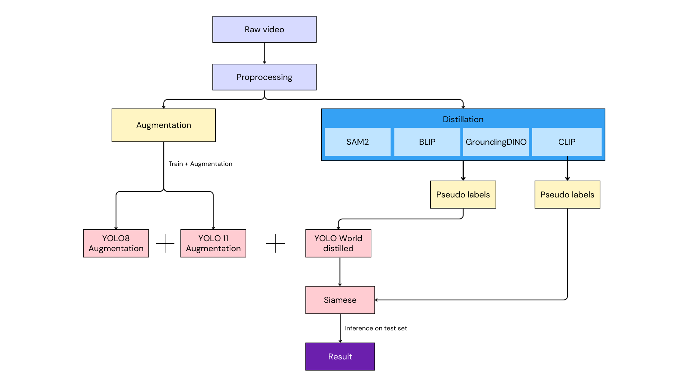

<div style="text-align: center;"> 
    <span style="font-size: 40px; font-weight: bold">
        INTRODUCTION TO DEEP LEARNING
    </span>
</div>
<div style="text-align: center;"> 
    <span style="font-size: 32px; font-weight: bold">
        AEROEYES <br>
        Finding and Rescuing with AI-Powered Drones
    </span>
</div>

<div style="text-align: center;"> 
    <span style="font-size: 24px; font-weight: bold">
        <i>
            README 
        </i>
    </span>
</div>

<div style="text-align: right;">
    <span style="font-size: 14px">
        <i>
            Jan 3, 2026
        </i>
    </span>
</div>

| Name | ID |
| --- | --- |
| Đinh Viết Lợi | 22120188 |
| Nguyễn Trần Lợi | 22120190 |
| Nguyễn Nhật Long | 22120194 |
| Nguyễn Lê Tấn Phát | 22120262 |
| Dương Ngọc Kiều Trinh | 22120389 |
| Nguyễn Phạm Tú Uyên | 22120422 |

---

<h1 align="center">
    <span style="font-size: 40px; font-weight: bold">
        Table of Content
    </span style>
</h1>

I. [Project Overview](#i)

II. [Dataset](#ii)

III. [File Structure](#v)

IV. [How to Run](#vi)

V. [Dependencies](#v)

VI. [Reference](#vi)

---

<h1 id="i" style="font-weight: bold">I. Project Overview</h1>



AeroEyes is a specialized computer vision solution developed for the Zalo AI Challenge 2025 (AeroEyes task), addressing the critical need for automated object detection in disaster response scenarios. This project focuses on reference-based object search, where the goal is to localize specific target objects (both spatially and temporally) within drone-captured videos, given only a small set of reference images.  

Traditional object detection methods often struggle with aerial imagery due to small object sizes, extreme viewpoint variations, and the lack of extensive annotated datasets for rare objects. To overcome these challenges, our solution adopts a two-stage framework that explicitly separates offline knowledge acquisition from online real-time deployment.

---

<h1 id="ii" style="font-weight: bold">II. Dataset</h1>

<h2 id="ii_1" style="font-weight: bold">1. Dataset DL Project</h2>

[Dataset_DL_Project](https://www.kaggle.com/datasets/loinguyen57/dataset-dl-project)

This dataset contains object-centric samples extracted from drone videos for object tracking and representation learning.

The data is organized into training and public test splits. Each sample corresponds to a single object instance, represented by cropped object images and associated video metadata.

```
observing/
├── train/
│   ├── annotations/
│   │   └── annotations.json
│   └── samples/
│       ├── <ObjectClass>_<ID>/
│           ├── object_images/  # Object reference image
│           └── drone_video.mp4 # Object video
│
└── public_test/
    └── samples/
        ├── <ObjectClass>_<ID>/
            ├── object_images/  # Object reference image
            └── drone_video.mp4 # Object video
```

<h2 id="ii_2" style="font-weight: bold">2. Grounding Dino Distillation Dataset</h2>

[grounding-dino-distillation-dataset](https://www.kaggle.com/datasets/trinhdngngckiu/groundingdino-distillation-dataset)

This dataset contains cropped object images extracted from the SIAMESE dataset using an object detection pipeline. It is primarily designed for tasks such as object re-identification, metric learning, Siamese/Triplet networks.

The data has been preprocessed into object-level image crops to facilitate efficient training and experimentation.

```
├── GroundingDINO/  # Github Repository (unnecessary)
└── distill_data/
    ├── siamese/
    │   └── crops/
    │       ├── Backpack_0_1000.jpg
    │       ├── Backpack_0_1001.jpg
    │       ├── Backpack_0_1002.jpg
    │       ├── ...
    ├── yolo/
    │   ├── images/
    │   │   ├── Backpack_0_10000.jpg
    │   │   ├── Backpack_0_10001.jpg
    │   │   ├── Backpack_0_10002.jpg
    │   │   ├── ...
    │   └── labels/
    │       ├── Backpack_0_10000.txt
    │       ├── Backpack_0_10001.txt
    │       ├── Backpack_0_10002.txt
    │       ├── ...
    └── siamese_metadata.json
```

<h2 id="ii_3" style="font-weight: bold">3. Yolo11s Augmentation Dataset Creation</h2>

[Yolo11s Augmentation Dataset Creation](https://www.kaggle.com/datasets/windstorm1412/yolo11s-augmentation-dataset-creation)

This dataset combines YOLO object detection and ReID data for joint detection–reidentification experiments.

```
zaic_yolo/
├── reid_dataset/        # Object ReID identities (unnecessary  )
│   └── <ID>/
├── yolo_dataset/        # YOLO-format detection data
│   ├── images/
│   ├── labels/
│   └── data.yaml
├── runs/det/            # YOLO training outputs
├── yolo11n.pt           # YOLOv11-nano weights
└── yolo11s.pt           # YOLOv11-small weights
```

<h2 id="ii_4" style="font-weight: bold">4. Train ZAIC DL</h2>

[Train_ZAIC_DL](https://www.kaggle.com/datasets/loinguyen57/train-zaic-dl)

This dataset contains object-centric data extracted from videos, organized by object class and identity. Taking from the train dataset the Competition provided
```
<DatasetRoot>/
└── <ObjectClass>_<ID>/
    ├── object_frames/   # Frame-level object crops
    └── object_images/   # Processed object images
```

<h2 id="ii_5" style="font-weight: bold">5. Test Dataset</h2>

[Test Dataset](https://www.kaggle.com/datasets/huyenco/test-dataset)

This dataset contains object-centric samples from videos, organized by object class and instance ID. Taking from the public test dataset the Competition provided.

```
samples/
└── <ObjectClass>_<ID>/
    ├── object_images/   # Cropped object images
    └── drone_video.mp4  # Source video
```

<h2 id="ii_6" style="font-weight: bold">6. Annotation</h2>

[Annotation](https://www.kaggle.com/datasets/huyenco/annotation)

This dataset contains structured annotation data used for model training. 
All metadata and labels are stored in a single JSON file, which defines the dataset annotations and related information.

```
<DatasetRoot>/
└── annotations.json   # Dataset annotations and metadata
```

<h2 id="ii_7" style="font-weight: bold">7. ZAIC Test Frames</h2>

[ZAIC_Test_Frames](https://www.kaggle.com/datasets/loinguyen57/zaic-test-frames)

This dataset contains object-centric samples from videos, organized by object class and instance ID. Taking from the public test dataset the Competition provided. (Identical to [Test Dataset](#ii_5) because of miscommunication)

```
samples/
└── <ObjectClass>_<ID>/
    ├── object_images/   # Cropped object images
    └── drone_video.mp4  # Source video
```

<h2 id="ii_8" style="font-weight: bold">8. Yolo World Distill</h2>

[Yolo World Distill](https://www.kaggle.com/datasets/uynnguynphmt/yolo-world-distill)

This dataset contains image data and corresponding object detection labels organized in YOLO format. 
It is designed for training and evaluating Yolo World model, including distilled labels.

```
<DatasetRoot>/
├── GroundingDINO/          # Github Repository (unnecessary)
├── yolo_world_distill/     # Distilled YOLO-World labels
|   ├── images/             # Input images
|   ├── labels/             # YOLO-format label files
└── data.yaml               # Dataset configuration file
```

---

<h1 id="iii" style="font-weight: bold">III. File Structure</h1>

```
<DatasetRoot>/ 
├── 📁 inference
│   └── 📄 pipeline-inference-drone.ipynb
├── 📁 model
│   ├── 📁 siamese_distillation
│   │   └── 📄 student_siamese_final.pt
│   ├── 📁 yolo11s_augmentation
│   │   └── 📄 best.pt
│   ├── 📁 yolov8s_augmentation
│   │   └── 📄 best.pt
│   └── 📁 yoloworld_distillation
│       └── 📄 best.pt
├── 📁 preprocessing
│   ├── 📄 siamese-distillation-dataset-creation.ipynb
│   ├── 📄 yolo11s-augmentation-dataset-creation.ipynb
│   └── 📄 yoloworld-distillation-dataset-creation.ipynb
├── 📁 training
│   ├── 📝 README.md
│   ├── 📄 siamese-train-distillation.ipynb
│   ├── 📄 yolo11s-train-augmentation.ipynb
│   ├── 📄 yolov8s-train-augmentation.ipynb
│   └── 📄 yoloworld-train-distillation.ipynb
├── 📝 README.md
├── 🖼️ pipeline_structure.png
└── 📄 requirements.txt
```

---

<h1 id="iv" style="font-weight: bold">IV. How to Run</h1>

Each Notebook's URL have already been setup with the right enviroment and data from kaggle.

<h2 id="iv_1" style="font-weight: bold">1. Pipeline from scratch</h2>

Open each Notebook's URL and choose run all in each notebook:

<h3 id="iv_1_a" style="font-weight: bold">a. Create dataset</h3>

* [Siamese Distillation Dataset Creation](https://www.kaggle.com/code/phatle1578/siamese-distillation-dataset-creation)

* [Yolo11s Augmentation Dataset Creation](https://www.kaggle.com/code/phatle1578/yolo11s-augmentation-dataset-creation)

* [YoloWorld Distillation Dataset Creation](https://www.kaggle.com/code/windstorm1412/yoloworld-distillation-dataset-creation)

<h3 id="iv_1_b" style="font-weight: bold">b. Training</h3>

* [Siamese Train Distillation](https://www.kaggle.com/code/phatle1578/siamese-train-distillation)

* [Yolo11s Train Augmentation](https://www.kaggle.com/code/phatle1578/yolo11s-train-augmentation)

* [Yolov8s Train Augmentation](https://www.kaggle.com/code/phatle1578/yolov8s-train-augmentation)

* [YoloWorld Train Distillation](https://www.kaggle.com/code/windstorm1412/yoloworld-train-distillation)

<h3 id="iv_1_c" style="font-weight: bold">c. Inference</h3>

* [Pipeline Inference Drone](https://www.kaggle.com/code/phatle1578/pipeline-inference-drone)

<h2 id="iv_2" style="font-weight: bold">2. Inference</h2>

* [Pipeline Inference Drone](https://www.kaggle.com/code/phatle1578/pipeline-inference-drone)
---

<h1 id="v" style="font-weight: bold">V. Dependencies</h1>

Python: 3.11.13

<h1 id="vi" style="font-weight: bold">VI. Reference</h1>

<h2 id="vi_1" style="font-weight: bold"> 1. Official Documentation & Repositories</h2>

[1] Ultralytics. YOLOv8, YOLO11, and YOLO-World Documentation.

[YOLO11](https://docs.ultralytics.com/vi/models/yolo11/) | [YOLOv8](https://docs.ultralytics.com/vi/models/yolov8/) | [YOLO-World](https://docs.ultralytics.com/vi/models/yolo-world/)

[2] Ultralytics. SAM2 (Segment Anything Model 2) by Ultralytics.

URL: [SAM2](https://docs.ultralytics.com/vi/models/sam/)

[3] Liu, S., et al. GroundingDINO: Marrying DINO with Grounded Pre-Training for Open-Set Object Detection.

GitHub: [IDEA-Research/GroundingDINO](https://github.com/IDEA-Research/GroundingDINO)


<h2 id="vi_2" style="font-weight: bold"> 2. Research Papers & Technical Reports</h2>

[4] Liang, J., et al. (2021). CBNetV2: A Composite Backbone Network Architecture for Object Detection. * arXiv: [2110.12638](https://arxiv.org/abs/2110.12638)

[5] Liu, Z., et al. (2021). Swin Transformer V2: Scaling Up Capacity and Resolution. * arXiv: [2112.11699](https://arxiv.org/abs/2112.11699)

[6] Ren, S., He, K., Girshick, R., & Sun, J. (2015). Faster R-CNN: Towards Real-Time Object Detection with Region Proposal Networks. * arXiv: [1506.01497](https://arxiv.org/abs/1506.01497)

[7] Redmon, J., Divvala, S., Girshick, R., & Farhadi, A. (2015). You Only Look Once: Unified, Real-Time Object Detection. * arXiv: [1506.02640](https://arxiv.org/abs/1506.02640)

[8] Zhao, J., et al. (2025). A comprehensive review on object detection in drone-based remote sensing images. * Journal: [ScienceDirect (Engineering Applications of AI)](https://www.sciencedirect.com/science/article/pii/S0952197625001988)

[9] Wu, X., et al. (2023). Object Detection in Remote Sensing Images Based on Improved YOLOv7 and Transformer. * Journal: [MDPI Sensors](https://www.mdpi.com/1424-8220/23/16/7190)

[10] Zhu, L., et al. (2021). TPH-YOLOv5: Improved YOLOv5 Based on Transformer Prediction Head for Object Detection on Drone-captured Scenarios. * Conference: [ICCVW 2021](https://openaccess.thecvf.com/content/ICCV2021W/VisDrone/html/Zhu_TPH-YOLOv5_Improved_YOLOv5_Based_on_Transformer_Prediction_Head_for_Object_ICCVW_2021_paper.html)

[11] DeepSeek-AI. (2025). DeepSeek-V3 Technical Report. * arXiv: [2501.17983](https://arxiv.org/pdf/2501.17983v2)

[12] Wang, H., et al. (2022). Hybrid Convolutional-Transformer framework for drone-based few-shot weakly supervised object detection. * Journal: [ScienceDirect (Computers and Electrical Engineering)](https://www.sciencedirect.com/science/article/abs/pii/S0045790622004025)